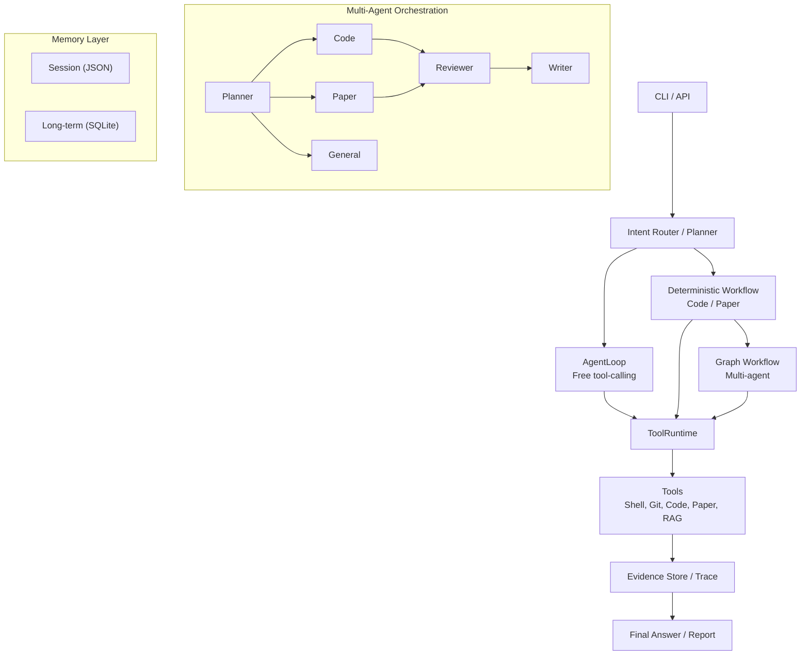

# ResearchPilot

[](https://github.com/lllll095/ResearchPilot-An-Agentic-Research-Assistant-for-Papers-and-Codebases/actions/workflows/test.yml)
[](LICENSE)
[](pyproject.toml)

A graph-based multi-agent research assistant for codebase understanding, academic paper research, and multi-turn conversation. Built with a custom agent runtime from the ground up (AgentLoop, ToolRuntime, GraphWorkflowRuntime, Blackboard Multi-agent, Conversation Memory, and Evaluation).

---

## Architecture



## Features

### Agent Runtime
- **AgentLoop** - Custom tool-calling loop with AgentState, Observation, and TraceStore
- **ToolRuntime** - Tool registry and execution with input/output schema validation
- **GraphWorkflowRuntime** - Lightweight LangGraph-style graph runtime supporting nodes, conditional edges, shared state, step records, and bounded loops
- **ParallelGroupNode** - Run multiple specialists concurrently and merge results

### Multi-Agent Orchestration
- **PlannerSubAgent** - LLM-based task routing (code, paper, general) with fallback rules
- **Specialist Agents** - CodeSubAgent, PaperSubAgent, GeneralSubAgent
- **ReviewerSubAgent** - Structured answer review with evidence grounding checks
- **WriterSubAgent** - Answer rewrite based on reviewer feedback
- **Blackboard** - Shared context with message isolation per subagent
- **RetryPolicy** - Configurable retry behavior (max_retries, fallback_to_writer, allowed_retry_agents)

### Research & Code Understanding
- **Adaptive Paper Research** - Local-first workflow: search local RAG, check evidence sufficiency, auto-download and index new papers if insufficient
- **Codebase QA** - Structured code map, search, read, and evidence-generated answers
- **Hybrid RAG** - Dense + BM25 retrieval with cross-encoder reranking and query routing
- **ripgrep Integration** - Fast code search with automatic Python fallback

### Memory & Conversation
- **Persistent Sessions** - JSON-based session storage with message history
- **Conversation Summary** - Automatic session summarization
- **Turn Memory** - Cross-turn evidence and code file carryover
- **Long-term Memory** - SQLite-backed persistent fact storage with keyword and tag retrieval
- **Memory Extractor** - Heuristic-based fact extraction from conversations

### Streaming & API
- **LLM Streaming** - Token-by-token streaming with error recovery
- **SSE Endpoint** - Server-Sent Events for real-time chat (`/chat/direct`)
- **FastAPI Server** - REST API with health, chat, and paper research endpoints
- **Agent Loop Streaming** - Step-by-step event streaming from the agent loop

### Tools
- **Shell** - Foreground/background execution, process tree kill, working directory control
- **Git** - Status, diff, commit with staging support
- **Code** - Directory map, keyword search (rg + Python), file reading
- **Paper** - arXiv search and download
- **RAG** - Search, evidence answer, index rebuild
- **Web Search** - Tavily integration

### Observability & Quality
- **Mermaid Visualization** - Auto-generated execution graph with visited node highlighting
- **Trace Report** - Detailed multi-agent execution trace with planner decisions and review results
- **Evaluation Harness** - Rule-based and LLM Judge evaluation for code, paper, and multi-agent
- **82 pytest Tests** - Covering graph runner, tool runtime, subagent logic, memory, streaming
- **Tool I/O Validation** - Schema-based input/output validation with descriptive error messages

## Quick Start

```bash
# Clone and install
git clone https://github.com/lllll095/ResearchPilot-An-Agentic-Research-Assistant-for-Papers-and-Codebases.git
cd ResearchPilot
pip install -e ".[dev]"

# Run all tests
python -m pytest tests/ -v

# Multi-agent chat with graph visualization
research-pilot chat --multi-agent --show-graph --show-plan

# Paper research
research-pilot paper-research "What is the architecture of agentic RAG?"

# Start API server
uvicorn research_pilot.api.server:app --host 127.0.0.1 --port 8000
```

## Project Structure

```
src/research_pilot/
    core/           AgentLoop, ToolRuntime, State, Trace, Observation
    agents/         LLM policy, Evidence writer, Mock agent
    tools/          Shell, Git, Code, Paper, RAG, Web Search, File
    workflows/      Code workflow, Paper workflow, Multi-agent, Intent router
    graph/          GraphWorkflowRuntime, Nodes, State, RetryPolicy
    multiagent/     Blackboard, SubAgents, Trace report
    conversation/   Session, Summary, Turn memory, Memory extractor
    memory/         Long-term memory store (SQLite)
    evaluation/     Paper, Code, Multi-agent, LLM Judge
    api/            FastAPI server, Request/response schemas
docs/               Architecture, Interview guide, Resume showcase
tests/              82 tests across 8 test files
```

## Test Coverage

| File | Tests | Coverage |
|---|---|---|
| test_graph_runner.py | 20 | Graph nodes, routing, retry, parallel groups, Mermaid |
| test_subagent_logic.py | 10 | Paper mode selection, planner normalization |
| test_tool_runtime.py | 15 | Tool registration, validation, shell, background |
| test_long_term_memory.py | 13 | SQLite store, retrieve, format, tags |
| test_blackboard.py | 5 | Context creation, subagent filtering |
| test_llm_client.py | 3 | Streaming, generator |
| test_agent_loop.py | 1 | Base loop execution |

## License

MIT License - see [LICENSE](LICENSE) for details.
