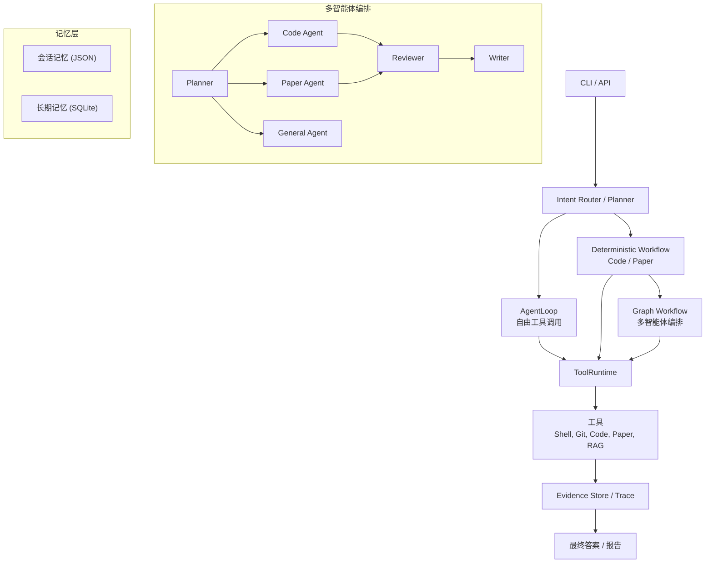

# ResearchPilot：图工作流驱动的多智能体研究助手

[](https://github.com/lllll095/ResearchPilot/actions/workflows/test.yml)
[](LICENSE)

ResearchPilot 是一个面向代码理解、论文研究、证据生成和多轮对话的 Agent Engineering 项目。

它不是一个简单的 RAG demo，而是从底层 AgentLoop、ToolRuntime、Workflow、GraphWorkflowRuntime、
到 Multi-agent Blackboard、Conversation Memory、Long-term Memory、Evaluation、Streaming
和 82 个 pytest 测试的完整工程实践。

---

## 架构图



## 核心组件

### Agent 运行时

- **AgentLoop** - 自定义工具调用循环，包含 AgentState、Observation、TraceStore
- **ToolRuntime** - 工具注册和执行引擎，支持输入输出 schema 校验
- **GraphWorkflowRuntime** - 轻量级 LangGraph 风格图运行时，支持节点、条件边、状态管理、retry 循环
- **ParallelGroupNode** - 多 specialist 并行执行并合并结果

### 多智能体编排

- **PlannerSubAgent** - LLM 驱动的任务路由（code / paper / general），带规则 fallback
- **CodeSubAgent** - 代码库问答，包装 CodeWorkflowRunner
- **PaperSubAgent** - 论文研究，支持自适应 local-first 流程
- **GeneralSubAgent** - 通用问题兜底
- **ReviewerSubAgent** - 结构化答案审查，检查证据充分性和相关性
- **WriterSubAgent** - 基于 reviewer 反馈改写答案
- **Blackboard** - 共享工作区，支持按 subagent 过滤上下文（消息隔离）
- **RetryPolicy** - 可配置重试策略（max_retries、fallback_to_writer、allowed_retry_agents）

### 论文研究与代码理解

- **自适应论文研究** - 先查本地 RAG，证据不足时自动搜索下载论文、重建索引、重新检索
- **代码库问答** - 结构化 code_map 到 code_search 到 code_read 到 write_code_answer 流程
- **混合 RAG** - Dense + BM25 检索 + Cross-encoder 重排序 + 查询路由
- **ripgrep 集成** - 快速代码搜索，自动回退到 Python 搜索

### 记忆系统

- **持久化会话** - JSON 文件存储的消息历史
- **会话摘要** - 自动 session summarization
- **Turn Memory** - 跨轮次的证据和代码文件继承
- **长期记忆** - SQLite 持久化事实存储，支持关键词和标签检索
- **记忆提取器** - 从对话中启发式提取关键事实

### 流式与 API

- **LLM Streaming** - 逐 token 流式输出，带错误恢复
- **SSE 端点** - Server-Sent Events 实时聊天
- **FastAPI 服务** - REST API，支持 health check、chat、paper research
- **Agent Loop Streaming** - AgentLoop 的事件流式输出

### 工具系统

- **Shell** - 前台/后台执行、进程树终止、工作目录控制
- **Git** - status、diff、commit，支持暂存区和文件筛选
- **Code** - 目录映射、关键词搜索、文件读取
- **Paper** - arXiv 搜索和下载
- **RAG** - 检索、证据答案生成、索引重建
- **Web Search** - Tavily 集成
- **输入/输出校验** - 基于 schema 的工具参数校验

### 可观测性

- **Mermaid 可视化** - 自动生成执行流程图，visited 节点高亮
- **Trace Report** - 详细的多智能体执行轨迹，包含 planner 决策、review 结果
- **Evaluation** - 规则评价 + LLM Judge 评价，覆盖 code、paper、multi-agent 工作流
- **82 个 pytest 测试** - 覆盖 graph runner、tool runtime、subagent 逻辑、记忆、streaming

## 快速开始

```bash
git clone https://github.com/lllll095/ResearchPilot.git
cd ResearchPilot
pip install -e ".[dev]"

# 跑测试
python -m pytest tests/ -v

# 多智能体对话
research-pilot chat --multi-agent --show-graph --show-plan

# 论文研究
research-pilot paper-research "什么是 agentic RAG？"

# 启动 API
uvicorn research_pilot.api.server:app --host 127.0.0.1 --port 8000

# 验证安装
python demo.py
```

## 测试覆盖

| 文件 | 数量 | 覆盖内容 |
|---|---|---|
| test_graph_runner.py | 20 | Graph 节点、路由、retry、并行组、Mermaid |
| test_subagent_logic.py | 10 | Paper 模式选择、Planner 归一化 |
| test_tool_runtime.py | 15 | 工具注册、校验、Shell、后台进程 |
| test_long_term_memory.py | 13 | SQLite 存储、检索、格式化、标签 |
| test_blackboard.py | 5 | 上下文创建、subagent 过滤 |
| test_llm_client.py | 3 | Streaming、generator |
| test_agent_loop.py | 1 | 基础循环执行 |

## 许可

MIT License - 详见 LICENSE
